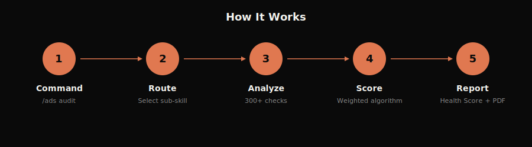
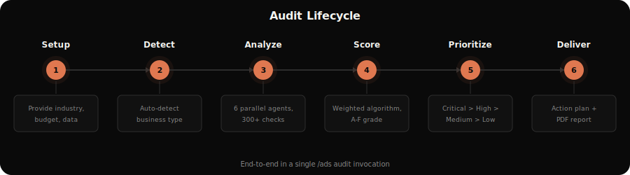
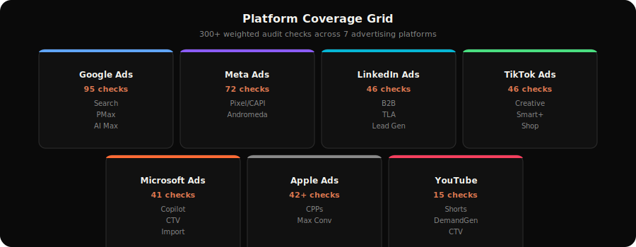
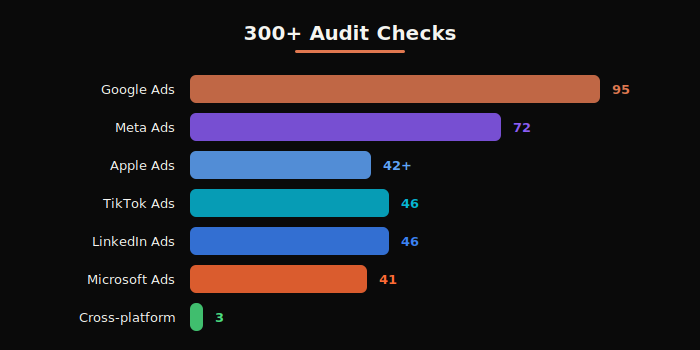
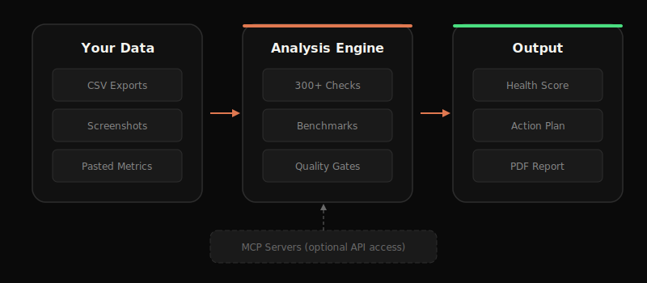

<p align="center">
  
</p>

# Claude Ads: Paid Advertising Audit & Optimization Skill

Comprehensive paid advertising audit and optimization skill conforming to the [Agent Skills](https://agentskills.io) open standard. Built and verified on Claude Code; experimental support for OpenAI Codex CLI, Cursor, Windsurf, Gemini CLI, and Goose. Covers Google Ads, Meta Ads, YouTube Ads, LinkedIn Ads, TikTok Ads, Microsoft Ads, Apple Ads, and (Wave 2+) Amazon Ads with **250+ audit checks**, industry-specific templates, parallel subagent delegation, PPC financial modeling, A/B test design, and PDF report generation.

[](https://agentskills.io)
[](LICENSE)
[](https://github.com/AgriciDaniel/claude-ads/releases)
[](https://github.com/AgriciDaniel/claude-ads/actions)
[](https://www.skool.com/ai-marketing-hub-pro)

**Host support:**
[](https://claude.ai/claude-code)
[](https://github.com/openai/codex)
[](https://cursor.sh)
[](https://codeium.com/windsurf)
[](https://github.com/google-gemini/gemini-cli)
[](https://block.github.io/goose/)

> **Two versions of this skill.** Choose the one that fits how you work:
>
> - 🌐 **Public open-source** — [`AgriciDaniel/claude-ads`](https://github.com/AgriciDaniel/claude-ads) — MIT-licensed, public releases (latest: `v1.5.1`), open to anyone. Use this if you want the stable, downloadable, no-membership-required version.
> - 🔒 **Community private mirror** (this repo) — [`AI-Marketing-Hub/claude-ads`](https://github.com/AI-Marketing-Hub/claude-ads) — early access to v1.6.0+ work, Wave 2 sub-skills (Amazon / Attribution / Server-side Tracking), the 10-Principle Thinking Framework, and direct collaboration with the [AI Marketing Hub Pro](https://www.skool.com/ai-marketing-hub-pro) community. Requires membership.
>
> The badges above track the **public** repo (`AgriciDaniel/claude-ads`) since the private mirror isn't visible to shields.io.

> **Blog:** [Read the full ad audit breakdown](https://agricidaniel.com/blog/claude-code-ad-agency)

## Contents

- [Installation](#installation)
- [Demo](#demo)
- [Quick Start](#quick-start)
- [Commands](#commands)
- [Features](#features)
- [Eval Harness (Wave 2)](#eval-harness-wave-2)
- [Architecture](#architecture)
- [How It Analyzes Your Ads](#how-it-analyzes-your-ads)
- [FAQ](#faq)
- [Requirements](#requirements)
- [Uninstall](#uninstall)
- [Related Projects](#related-projects)
- [License](#license)

## Installation

> ℹ️ **Which version are you installing?**
>
> - **Not an AI Marketing Hub Pro member?** Install from the public repo instead → [`AgriciDaniel/claude-ads`](https://github.com/AgriciDaniel/claude-ads). All the install commands below work there too — just swap `AI-Marketing-Hub/claude-ads` for `AgriciDaniel/claude-ads` and the plugin slug `claude-ads@ai-marketing-hub-claude-ads` for `claude-ads@agricidaniel-claude-ads`. Public releases ship there; this private mirror runs ahead of public releases.
> - **Pro member?** The commands below install the **community version** with early access to in-development features. They require an authenticated `gh auth login` (or GitHub PAT) session with access to the `AI-Marketing-Hub` org. If `/plugin marketplace add` fails with a 404, your account isn't in the org yet — DM in the [Skool community](https://www.skool.com/ai-marketing-hub-pro) to get added.

### Plugin Install (Claude Code — Recommended)

Add the marketplace and install in Claude Code:

```shell
/plugin marketplace add AI-Marketing-Hub/claude-ads
/plugin install claude-ads@ai-marketing-hub-claude-ads
```

This registers claude-ads as a native plugin with auto-updates, namespace isolation, and proper version tracking.

### One-Command Install (Unix/macOS/Linux)

```bash
curl -fsSL https://raw.githubusercontent.com/AI-Marketing-Hub/claude-ads/main/install.sh | bash
```

### One-Command Install (Windows PowerShell)

```powershell
irm https://raw.githubusercontent.com/AI-Marketing-Hub/claude-ads/main/install.ps1 | iex
```

### Cross-Host Install (Codex CLI / Cursor / Windsurf / Gemini CLI / Goose)

The installer auto-detects each host's expected skill directory via `--target=<host>`:

```bash
# Unix/macOS/Linux
bash install.sh --target=codex      # OpenAI Codex CLI       (experimental)
bash install.sh --target=cursor     # Cursor IDE              (experimental)
bash install.sh --target=windsurf   # Windsurf IDE            (experimental)
bash install.sh --target=gemini     # Gemini CLI              (experimental)
bash install.sh --target=goose      # Goose CLI               (experimental)
```

```powershell
# Windows PowerShell
.\install.ps1 -Target codex
.\install.ps1 -Target cursor
.\install.ps1 -Target windsurf
.\install.ps1 -Target gemini
.\install.ps1 -Target goose
```

**Per-host install path table:**

| Target     | Skills root                                     | Agents root                                | Python deps |
|------------|-------------------------------------------------|--------------------------------------------|-------------|
| `claude`   | `~/.claude/skills`                              | `~/.claude/agents`                         | ✓           |
| `codex`    | `~/.codex/skills`                               | `~/.codex/agents`                          | ✓           |
| `cursor`   | `~/.cursor/extensions/claude-ads/skills`        | `~/.cursor/extensions/claude-ads/agents`   | skipped     |
| `windsurf` | `~/.windsurf/skills`                            | `~/.windsurf/agents`                       | skipped     |
| `gemini`   | `~/.gemini/extensions/claude-ads/skills`        | `~/.gemini/extensions/claude-ads/agents`   | skipped     |
| `goose`    | `~/.config/goose/skills`                        | `~/.config/goose/agents`                   | skipped     |

**Path overrides** — if your host CLI uses a different layout, pin paths explicitly:

```bash
bash install.sh --target=claude --skill-dir=~/custom/skills --agent-dir=~/custom/agents
```

Targets and override paths are strictly whitelist-validated (no shell injection, no flag confusion, no `..` segments, no UNC paths).

> ⚠ **Experimental targets:** Only Claude Code is verified end-to-end. The other host install paths follow each host's documented convention but their skill discovery / sub-skill routing may differ. Open an issue with reproduction details if a target needs adjustment.

### Manual Install

```bash
git clone https://github.com/AI-Marketing-Hub/claude-ads.git
cd claude-ads
./install.sh                # Unix/macOS/Linux, default target=claude
./install.sh --target=codex # any cross-host target
```

```powershell
.\install.ps1                # Windows PowerShell, default Target=claude
.\install.ps1 -Target codex
```

<p align="center">
  
</p>

## Demo

<p align="center">
  
</p>

## Quick Start

```bash
# Start Claude Code
claude

# Run a full multi-platform audit
/ads audit

# Deep analysis for a single platform
/ads google
/ads meta
/ads linkedin

# Strategic planning by business type
/ads plan saas
/ads plan ecommerce
/ads plan local-service

# Cross-platform creative audit
/ads creative

# Budget and bidding strategy review
/ads budget
```

<p align="center">
  
</p>

## Commands

| Command | Description |
|---------|-------------|
| `/ads audit` | Full multi-platform audit with parallel subagent delegation |
| `/ads google` | Google Ads deep analysis (Search, PMax, AI Max, Display, YouTube, Demand Gen) |
| `/ads meta` | Meta Ads deep analysis (FB, IG, Threads, Advantage+, Andromeda + GEM + Lattice) |
| `/ads youtube` | YouTube Ads specific analysis (Skippable, Shorts, Demand Gen, CTV) |
| `/ads linkedin` | LinkedIn Ads deep analysis (B2B, Lead Gen, TLA, ABM) |
| `/ads tiktok` | TikTok Ads deep analysis (Creative, Shop, Smart+, post-USDS) |
| `/ads microsoft` | Microsoft/Bing Ads deep analysis (Copilot, Import validation) |
| `/ads apple` | Apple Ads deep analysis (CPPs, Maximize Conversions, AdAttributionKit, TAP) |
| `/ads amazon` | Amazon Ads deep analysis (Sponsored Products / Brands / Display, ACOS / TACOS) — *Wave 2* |
| `/ads attribution` | Cross-platform attribution audit (AdAttributionKit, GA4, Consent Mode V2, MMP) — *Wave 2* |
| `/ads tracking` | Server-side tracking pipeline audit (sGTM, CAPI Gateway, dedup, hashing) — *Wave 2* |
| `/ads creative` | Cross-platform creative quality audit and fatigue detection |
| `/ads landing` | Landing page quality assessment for ad campaigns |
| `/ads budget` | Budget allocation and bidding strategy review |
| `/ads plan <type>` | Strategic ad plan with industry templates |
| `/ads competitor` | Competitor ad intelligence across all platforms |
| `/ads math` | PPC financial calculator (CPA, ROAS, break-even, budget forecasting, LTV:CAC) |
| `/ads test` | A/B test design (hypothesis framework, significance, sample size, duration) |
| `/ads report` | Generate PDF audit report for client deliverables |
| `/ads dna <url>` | Extract brand DNA from website → `brand-profile.json` |
| `/ads create` | Generate campaign concepts + copy briefs → `campaign-brief.md` |
| `/ads generate` | Generate AI ad images from brief → `ad-assets/` |
| `/ads photoshoot` | Product photography in 5 styles (Studio, Floating, Ingredient, In Use, Lifestyle) |

### `/ads audit`
**Full Multi-Platform Audit**

Spawns 6 parallel subagents to analyze your ad accounts simultaneously:
- **audit-google**: 80 checks across Search, PMax, AI Max, Demand Gen, CTV, YouTube
- **audit-meta**: 50 checks across Pixel/CAPI, Andromeda creative diversity, Structure, Audience
- **audit-creative**: cross-platform creative quality with Andromeda Entity-ID and Symphony awareness
- **audit-tracking**: conversion tracking + privacy infrastructure (Consent Mode V2, CAPI, Events API, AdAttributionKit)
- **audit-budget**: budget and bidding strategy across LinkedIn, TikTok, Microsoft
- **audit-compliance**: compliance, settings, performance benchmarks across all platforms

Generates a unified **Ads Health Score (0-100)** with prioritized action plan.

> **Wave 2 standalone sub-skills.** `/ads audit` parallel-delegates the 6 agents above. Amazon Ads, cross-platform attribution, and server-side tracking are covered by their standalone sub-skills (`/ads amazon`, `/ads attribution`, `/ads tracking`) — invoke them directly. Wave 3 will add their paired audit agents so they can dispatch in parallel during the full audit.

<p align="center">
  
</p>

<p align="center">
  
</p>

### `/ads plan <business-type>`
**Strategic Ad Planning**

Industry-specific templates with platform mix, campaign architecture, creative strategy, targeting, budget guidelines, and KPI targets.

**Supported business types:**
- `saas`: Trial/demo focus, Google + LinkedIn primary
- `ecommerce`: Shopping/PMax, ROAS-focused, seasonal
- `local-service`: Google Search + LSA, call tracking, geo radius
- `b2b-enterprise`: LinkedIn ABM, long sales cycle, pipeline metrics
- `info-products`: Meta + YouTube, webinar/VSL funnels
- `mobile-app`: Meta + Google UAC, MMP required, LTV:CPI
- `real-estate`: Special Ad Category (housing), buyer/seller campaigns
- `healthcare`: HIPAA compliance, LegitScript, restricted targeting
- `finance`: Special Ad Category (credit), required disclosures
- `agency`: Multi-client management, reporting framework
- `generic`: Universal template with platform selection questionnaire

<p align="center">
  
</p>

### `/ads math` and `/ads test`

<p align="center">
  
  
</p>

### `/ads report`

Generate professional PDF audit reports for client deliverables with health score gauge, platform comparison charts, pass/fail distribution, formatted tables, and zero-overlap layout.

<p align="center">
  
</p>

## Features

### 250+ Audit Checks
Comprehensive coverage across all platforms with weighted severity scoring:

| Platform | Checks | Key Areas |
|----------|--------|-----------|
| Google Ads | 80 | Search, PMax, AI Max (`ai_max_setting`, AI Brief, FUE), Demand Gen, CTV, YouTube |
| Meta Ads | 50 | Pixel/CAPI, Andromeda + GEM + Lattice, Entity-ID clustering, ASC/AAC, Structure, Audience |
| LinkedIn Ads | 27 | B2B targeting, TLA, Lead Gen, CRM integration |
| TikTok Ads | 28 | Creative-first, Smart+, GMV Max, Search Ads, Events API (post-USDS) |
| Microsoft Ads | 24 | Google import safety, Copilot, CTV, LinkedIn targeting, video |
| Apple Ads | 35+ | Campaign structure, CPPs, Maximize Conversions, AdAttributionKit |
| Amazon Ads | 30+\* | Sponsored Products / Brands / Display, ACOS / TACOS, search-term harvesting |
| Cross-platform | 3 | Privacy infrastructure, creative diversity, refresh cadence |
| Attribution + Server-side | 25+\* | AdAttributionKit, GA4, Consent Mode V2, sGTM, CAPI Gateway, hash quality |

> \* **Verified vs estimated counts.** The 209 checks for Google (80), Meta (50), LinkedIn (27), TikTok (28), and Microsoft (24) are bidirectionally verified against the eval harness catalog (`tests/fixtures/check-catalog.yaml`) — they can't drift without failing CI. Apple, Amazon, Cross-platform, and Attribution + Server-side counts are inline thresholds in their respective SKILL.md files; corresponding audit reference files and catalog entries land in Wave 3 (`apple-audit.md`, `amazon-audit.md`, `attribution-audit.md`).

<p align="center">
  
</p>

<p align="center">
  
</p>

### Ads Health Score (0-100)
Weighted scoring algorithm with severity multipliers:

| Grade | Score | Action Required |
|-------|-------|-----------------|
| A | 90-100 | Minor optimizations only |
| B | 75-89 | Some improvement opportunities |
| C | 60-74 | Notable issues need attention |
| D | 40-59 | Significant problems present |
| F | <40 | Urgent intervention required |

<p align="center">
  
</p>

### Eval Harness (Wave 2)
41-test pytest suite ships in `tests/` and runs in CI on every commit:

- **Routing snapshots** — every documented trigger phrase routes to its expected sub-skill (catches description regressions)
- **Check-catalog coverage** — bidirectional check between `tests/fixtures/check-catalog.yaml` and every audit reference file; no orphan IDs, no untracked rows
- **Scoring math** — re-implements the weighted-score algorithm; asserts determinism across 10 runs and correct severity weighting
- **SSRF regression suite** — 27 IPv4/IPv6 blocklist cases, non-HTTP scheme blocks, DNS fail-closed, credential redaction

No competing paid-ads skill ships a regression suite. This is the moat that makes claude-ads auditable end-to-end.

### Industry Detection
Auto-detects business type from ad account signals (product feeds, conversion events, platform mix, targeting patterns) and loads industry-specific benchmarks and templates.

### Quality Gates
Hard rules enforced during every audit:
- Never recommend Broad Match without Smart Bidding (Google)
- 3x Kill Rule: flag CPA >3x target for immediate pause
- Budget sufficiency: Meta >=5x CPA/ad set, TikTok >=50x CPA/ad group
- Learning phase protection: no edits during active learning
- Compliance: auto-check Special Ad Categories (housing/credit/finance)
- **Privacy infrastructure gate**: verify tracking stack (Consent Mode V2, CAPI, Events API, AdAttributionKit) before optimization recommendations
- **Andromeda creative diversity**: flag Meta accounts with <10 genuinely distinct creatives

<p align="center">
  
</p>

### Creative Pipeline

AI-powered creative generation with 4 specialized agents:

<p align="center">
  
</p>

### Reference Data
26 built-in reference files with 2026-current benchmarks, bidding decision trees, platform specifications, compliance requirements, conversion tracking guides, MCP integration guide, and additional platform coverage.

### 10-Principle Thinking Framework
Every command operates under a shared thinking discipline — **OBSERVE × 2 / LISTEN / THINK / CONNECT × 2 / FEEL / ACCEPT / CREATE / GROW** — defined in [`ads/references/thinking-framework.md`](ads/references/thinking-framework.md). The framework maps each principle to concrete ad-work behavior + anti-pattern + workflow trigger. It is what separates a number-crunching report from a strategic deliverable. Load before any audit, plan, or creative output.

### Data Handling & Privacy
Claude Ads runs entirely on your local machine via Claude Code. No ad account data is sent to external servers. When using MCP servers for live API access, data flows directly between your machine and the ad platform APIs. All analysis happens locally.

<p align="center">
  
</p>

## Architecture

<p align="center">
  
</p>

```
~/.claude/skills/ads/              # Main orchestrator
~/.claude/skills/ads/references/   # 25 RAG reference files
~/.claude/skills/ads-*/            # 22 sub-skills (incl. ads-math, ads-test, ads-amazon, ads-attribution, ads-server-side-tracking)
~/.claude/skills/ads-plan/assets/  # 12 industry templates
~/.claude/agents/                  # 10 agents (6 audit + 4 creative)
~/.claude/skills/ads/tests/        # 41-test pytest eval harness (Wave 2)
```

### How It Works

1. **Orchestrator** (`/ads`) routes commands to specialized sub-skills
2. **Sub-skills** provide deep single-domain analysis with structured output
3. **Agents** run in parallel during full audits for maximum speed
4. **References** load on-demand (RAG pattern); only what's needed per analysis
5. **Templates** provide industry-specific strategy frameworks

## How It Analyzes Your Ads

**Claude Ads works with data you provide**; exports, screenshots, or pasted metrics from your ad platform dashboards. It does not connect to any ad platform API automatically.

**To get accurate, account-specific recommendations:**
1. Export your account data (last 30 days recommended)
2. Run the relevant command: `/ads google`, `/ads audit`, etc.
3. Claude will ask for your industry and budget context first; provide these for relevant benchmarks
4. Paste or share your data when prompted

<p align="center">
  
</p>

### Live Data Integration (Optional)

For direct API access without manual exports, pair Claude Ads with MCP servers. See `ads/references/mcp-integration.md` for setup guides:
- **Google Ads**: [mcp-google-ads](https://github.com/cohnen/mcp-google-ads): 29 GAQL tools for live API access
- **Meta Ads**: [Adspirer MCP](https://www.adspirer.com) (commercial); for a self-hosted option, wrap the Meta Marketing API and feed JSON into the standard data-collection flow
- **LinkedIn Ads**: [GrowthSpree MCP](https://www.growthspreeofficial.com) or [Adzviser MCP](https://adzviser.com)

<p align="center">
  
</p>

## FAQ

**Can Claude Ads log into my ad manager automatically?**
No. Claude Ads analyzes data you provide (exports, screenshots, or pasted metrics). It doesn't connect to ad platforms automatically. See the Live Data Integration section above for Google Ads API access via MCP.

**Does it use real account data or generic benchmarks?**
Benchmarks are based on industry research (WordStream, Triple Whale, etc.) covering 16,000+ campaigns. They're averages; your results will vary by industry, budget level, and account maturity. Always provide your industry and monthly spend when running audits for the most relevant comparisons.

**Is ad posting or campaign creation still manual?**
Yes. Claude Ads is an audit and strategy tool. It finds issues, recommends fixes, and builds campaign plans; but creating, editing, or posting ads remains manual in your ad platform.

**Why do some recommendations seem off for my account size?**
Benchmarks and best practices differ significantly between a $500/month account and a $50k/month account. Always tell Claude your budget upfront: *"I spend $2k/month on Google Ads for a local plumbing business"* gives much better results than running `/ads google` without context.

**Does it support [platform] ads?**
Currently supported: Google, Meta (Facebook/Instagram), YouTube, LinkedIn, TikTok, Microsoft/Bing, and Apple Ads. Additional platforms (Reddit, CTV/OTT, Pinterest, Snapchat) are covered in the reference guide for strategic planning.

## Requirements

- Claude Code CLI
- Python 3.10+ with Playwright (optional, for live landing page analysis)
- reportlab (optional, for PDF report generation via `/ads report`)

## Uninstall

### Unix/macOS/Linux

```bash
curl -fsSL https://raw.githubusercontent.com/AI-Marketing-Hub/claude-ads/main/uninstall.sh | bash
```

### Windows PowerShell

```powershell
irm https://raw.githubusercontent.com/AI-Marketing-Hub/claude-ads/main/uninstall.ps1 | iex
```

## Related Projects

- 🌐 **[claude-ads (public)](https://github.com/AgriciDaniel/claude-ads)** — the open-source version of this skill (MIT, latest public release `v1.5.1`). Use this if you're not in the Pro community.
- [Claude SEO](https://github.com/AgriciDaniel/claude-seo) — comprehensive SEO analysis skill for Claude Code

## License

MIT License - see [LICENSE](LICENSE) for details.

---

Built for Claude Code by [@AgriciDaniel](https://github.com/AgriciDaniel)

---

## Author

Built by [Agrici Daniel](https://agricidaniel.com/about) - AI Workflow Architect.

- [Blog](https://agricidaniel.com/blog) - Deep dives on AI marketing automation
- [AI Marketing Hub](https://www.skool.com/ai-marketing-hub) - Free community, 2,800+ members
- [YouTube](https://www.youtube.com/@AgriciDaniel) - Tutorials and demos
- [All open-source tools](https://github.com/AgriciDaniel)
