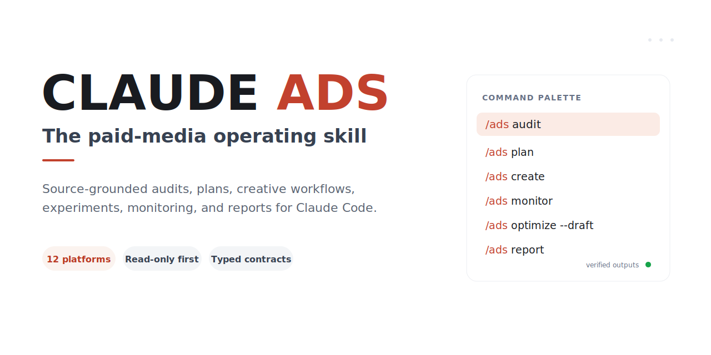
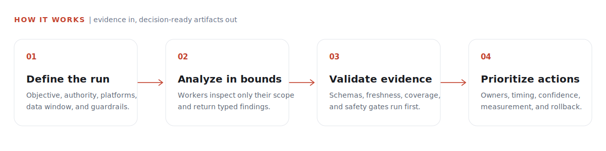
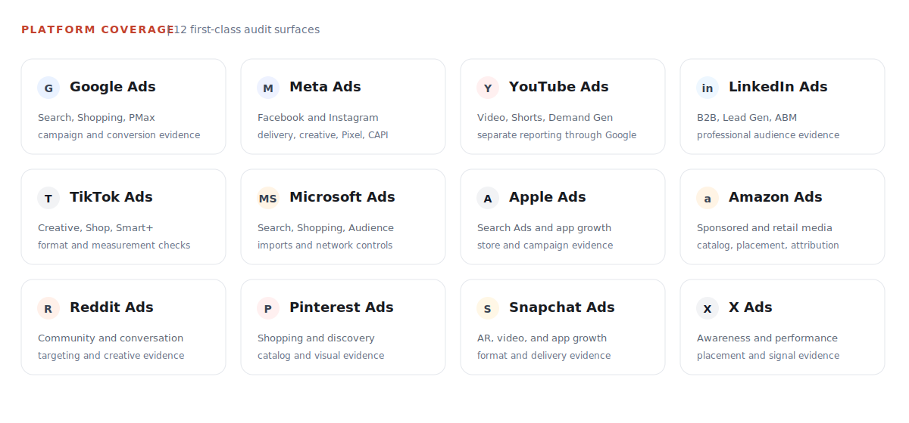
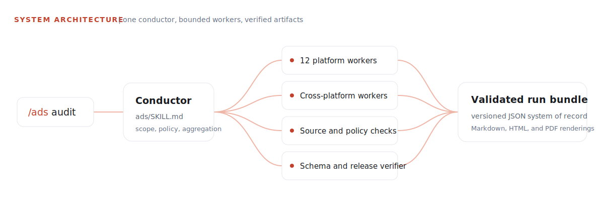
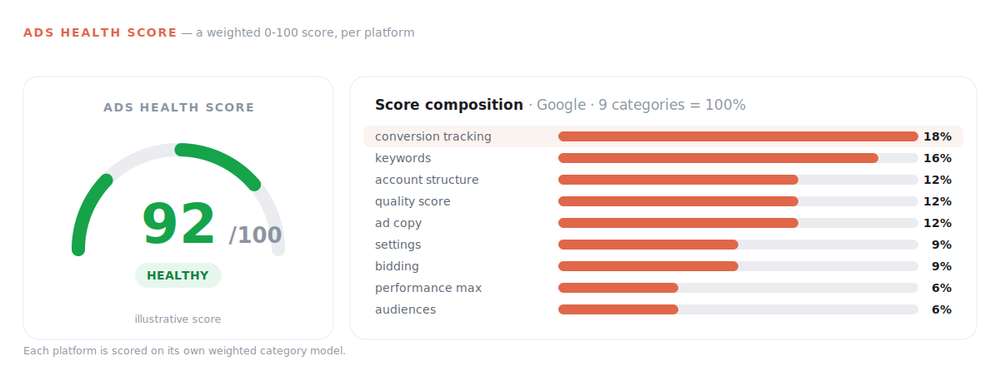

<p align="center">
  
</p>

# Claude Ads

Claude-first, portable paid-media operations for agencies, consultants, and
in-house performance teams.

Claude Ads turns authorized exports or account reads into source-grounded
audits, plans, creative workflows, experiments, monitoring, and reports. It is
read-only by default. Live changes stay disabled until the exact platform and
operation pass approval, idempotency, verification, audit, and rollback gates.

<p align="center">
  
</p>

## What it does

- Audits paid-media accounts with dated evidence and explicit confidence.
- Plans campaigns, channels, budgets, measurement, and experiments.
- Creates copy, image, video, and product-photo briefs and assets.
- Monitors pacing, delivery, tracking, fatigue, policy, and performance.
- Produces versioned JSON, then renders Markdown, HTML, and optional PDF.
- Drafts safe account changes without applying them by default.
- Reports missing data, stale sources, contradictions, and partial failures.

## Platforms

<p align="center">
  
</p>

| Search, video, and social | Commerce and retail media |
| --- | --- |
| Google Ads | Apple Ads |
| Meta Ads | Amazon Ads |
| YouTube Ads | Pinterest Ads |
| LinkedIn Ads |  |
| TikTok Ads |  |
| Microsoft Advertising |  |
| Reddit Ads |  |
| Snapchat Ads |  |
| X Ads |  |

Each platform has a focused skill, audit worker, control reference, capability
declaration, and testable routing surface. The
[capability manifest](control-plane/manifests/capability-manifest.json) is the
authoritative record for live reads and writes.

## Commands

Standalone installs use `/ads`. Claude Code plugins are namespaced and use
`/claude-ads:ads`. Both load the same `ads/SKILL.md` contract.

| Command | Outcome |
| --- | --- |
| `/ads setup` | Create the client, account, KPI, privacy, and guardrail profile |
| `/ads audit [all\|platform\|scope]` | Run a complete or scoped evidence-backed audit |
| `/ads plan` | Build channel, campaign, budget, competitor, and measurement plans |
| `/ads create` | Produce copy, image, video, or product-photo assets |
| `/ads launch --draft` | Draft a campaign mutation plan without changing the account |
| `/ads monitor` | Review pacing, delivery, tracking, fatigue, policy, and performance |
| `/ads optimize --draft` | Draft evidence-backed optimization changes |
| `/ads experiment` | Design or read out a controlled test |
| `/ads report` | Render a validated JSON run bundle |
| `/ads research refresh` | Refresh platform, policy, API, benchmark, and ecosystem evidence |
| `/ads validate` | Validate contracts, runs, capabilities, maturity, or release readiness |
| `/ads status`, `/ads next` | Show current status and the highest-priority blocker |

Platform shortcuts such as `/ads google`, `/ads meta`, `/ads amazon`, and
`/ads reddit` route to the matching platform audit.

## Demo

<p align="center">
  
</p>

The GIF shows the original command-discovery experience. The v2 command table
above and the platform table are current and authoritative.

## Installation

Claude Code is the canonical runtime. Codex, Gemini, Cursor, Windsurf, Goose,
and compatible Agent Skills hosts can consume the same skill files where their
runtime supports them.

Prefer the host's native plugin flow or a tagged release archive with a verified
SHA-256 checksum. Never pipe a remote installer directly to a shell.

From an authenticated local checkout of the private v2 branch:

```bash
git clone --branch v2 https://github.com/AI-Marketing-Hub/claude-ads.git
cd claude-ads
bash install.sh --source=local
```

Select another standalone host explicitly:

```bash
bash install.sh --target=codex --source=local
bash install.sh --target=gemini --source=local --no-deps
```

PowerShell uses the same managed ownership model:

```powershell
git clone --branch v2 https://github.com/AI-Marketing-Hub/claude-ads.git
Set-Location claude-ads
.\install.ps1 -Source local
```

Managed dependencies support CPython 3.11 and 3.12 on the declared Linux,
macOS, and Windows wheel matrix. Unsupported interpreters fail before the
destination changes. Use `--no-deps` or `-NoDeps` for a skill-only install.

Browser capture requires an operator-installed Playwright browser payload. PDF
rendering requires the host's WeasyPrint and Pango system libraries. These are
documented in the
[external runtime dependency manifest](control-plane/manifests/external-runtime-dependencies.json).

Uninstall only manifest-owned files:

```bash
bash uninstall.sh --target=claude
```

The PowerShell equivalent is `uninstall.ps1`.

## Architecture

<p align="center">
  
</p>

One conductor owns scope, policy, aggregation, and final artifacts. Workers
analyze bounded slices and return schema-valid findings. Required-worker failure
makes the run partial. It is never silently presented as a complete audit.

The canonical result is versioned JSON. Markdown, HTML, and PDF are renderings
of the same validated run bundle.

## Scoring and evidence

<p align="center">
  
</p>

Controls use `pass`, `fail`, `unknown`, or `not_applicable`.

- Health, evidence coverage, regulatory exposure, and opportunities stay separate.
- Unknown controls reduce evidence coverage without changing known health.
- Coverage of 80% or more is graded, 60 to 79% is provisional, and below 60%
  is insufficient evidence.
- Optional, beta, premium, unavailable, and ineligible features stay unscored.
- A disabled or unapproved platform profile produces no health score.
- A failed platform is excluded from portfolio scoring and makes the run partial.

See the [scoring reference](ads/references/scoring-system.md) and production
implementation in `claude_ads_core/scoring.py`.

## Account safety

All adapters are read-only by default. Applying a change requires:

1. A tested and enabled capability for the exact operation.
2. Explicit account and object IDs.
3. A human-readable before and after diff with blast radius.
4. Owner approval within account-defined ceilings.
5. An idempotency key, audit destination, rollback, and verification window.
6. Verification that remote state still matches the mutation precondition.

Missing ceilings mean no write. Permanent deletion is not supported in v2.
Credentials belong in environment variables, an OS keychain, or an approved
secret manager. They never belong in the repository, profiles, reports, or logs.

## Evidence and release controls

The public-safe `control-plane/` records product boundaries, dated sources,
claims, capabilities, safety rules, privacy rules, ecosystem decisions, and
release requirements.

- No source means no current platform claim.
- No implementation, fixture, and test means no capability claim.
- No approval and rollback means no account mutation.
- No independent verification means no release.

See the [release requirements](control-plane/RELEASE_REQUIREMENTS.md) and
[publishing policy](control-plane/PUBLISHING_POLICY.md).

## Development

Create a virtual environment and run the complete suite:

```bash
python3.12 -m venv .venv
.venv/bin/python -m pip install --no-deps -e .
.venv/bin/python -m pip install --require-hashes --only-binary=:all: -r requirements.lock
.venv/bin/python -m pip install --require-hashes --only-binary=:all: -r requirements-dev.lock
.venv/bin/python -m pip check
.venv/bin/python -m pytest -q
```

Useful focused checks:

```bash
python -m claude_ads_core --version
python -m claude_ads_core validate finding path/to/finding.json
bash -n install.sh uninstall.sh
```

## Repository map

```text
ads/                  main skill, interface metadata, and shared references
skills/               platform and lifecycle skills
agents/               platform, cross-platform, research, and verifier workers
claude_ads_core/      typed contracts, adapters, validation, and scoring
control-plane/        evidence, capability, safety, maturity, and release state
scripts/              browser, creative, reporting, and release helpers
evals/                routing and behavioral evaluation cases
tests/                deterministic, security, installer, and adapter tests
```

## Privacy and publication

The canonical repository remains private until the owner approves a separate
public-release gate. Client data, raw private research, captured prompts,
credentials, account exports, and agent transcripts must never enter Git history
or release archives.

## License

Original Claude Ads code and documentation are available under the MIT License.
Third-party APIs, trademarks, documentation, and cited artifacts remain subject
to their own terms. Review the [source ledger](control-plane/manifests/source-ledger.json)
and [third-party notices](THIRD_PARTY_NOTICES.md) before importing external work.
